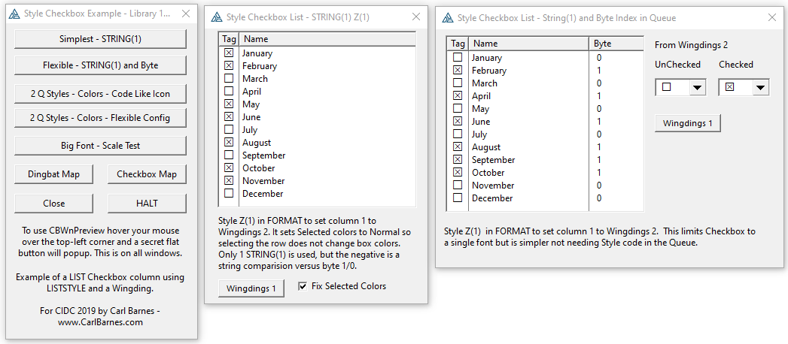
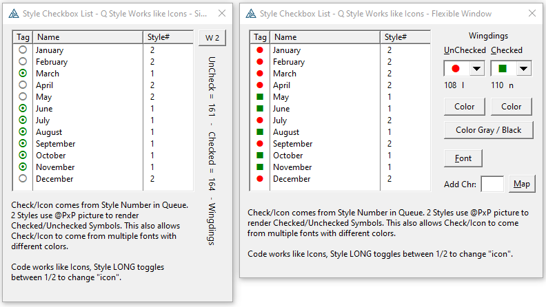
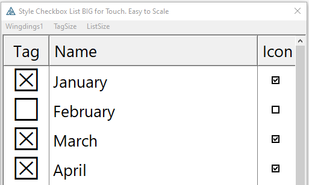
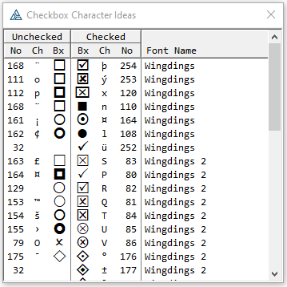
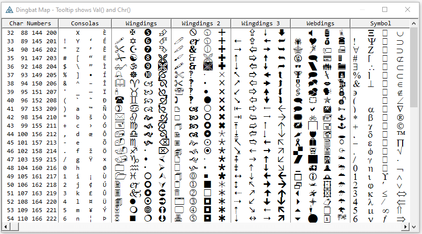

# LIST Checkbox Column using Style and WingDing Font

I had a Class that had a LIST control in which I wanted a Checkbox column. Using an Icon meant I would have to also include an .ICO file or rely on the shipping images. What I came up with was to use a Style that changed the font to WingDings `?List{PROPSTYLE:FontName,1}='Wingdings 2'`.

I included this "Style Checkbox" in my CIDC 2019 presentation on Window Preview. The example files are included in this repo. Below are some screen shots.

This is the main menu is simply buttons. The two examples implement checkboxes using WingDings 2. They use FORMAT(' Z(1) ') for the checkbox column so every row is the same style. There is no need for a Queue field. A change in the checkbox is simply a change in the queue data for the cell. There can be no other style changes. The Z(1) style method is the way to change the font, and others, for an entire column. Many times I will have a column using Font Consolas so it is fixed width.

The two "2 Q Styles" button are LIST's with FORMAT(' Y ') Style code n the column that expects in the Queue there will be a LONG after the data field. This allows changing all 16 style fields so you can mix fonts and colors. On the right side screen capture you see Red and Green.

Styles allow a Font Size so in the below window you see the Checkbox square is very large. This would help for a touch interface or simply to attack attention. Because this is a font it scales perfectly with no pixelating unlike a bitmap icon.  

I included a "Checkbox Map" window showing a list with many characters I thought would work as checkboxes or be useful in a LIST.

I included a "Ding Bat Map" showing all the characters in Wingdings and Webdings.

